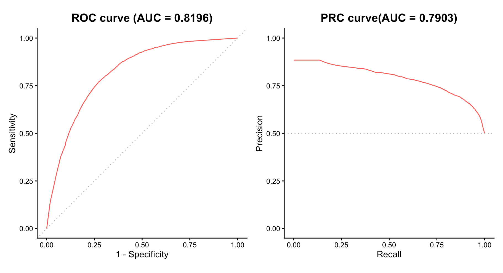

# DiabetesPredictor

## Overview

**“DiabetesPredictor”** is a reproducible machine learning software
package developed for the **BIO215 Capstone Project**. It encapsulates a
pre-trained Random Forest classifier derived from **Kaggle: the BRFSS
2015 dataset** to predict diabetes risk based on clinical health
indicators.

## Features

- **Pre-trained Model**: Includes a high-performance Random Forest model
  (AUC ~ 0.82).
- **Automated Preprocessing**: Automatically handles factor level
  mapping (e.g., converting numeric inputs like `1` to `Excellent` for
  General Health) to ensure robust inference.

## Interactive Web Application

Experience the model in action through our user-friendly Shiny interface. You can explore the dataset, visualize distributions, and perform real-time risk assessments.


👉 **Live Demo:** [Launch DiabetesPredictor App](https://colinzhichengyang.shinyapps.io/bio215_DiabetesPredictor/)

## Installation

You can install the development version of DiabetesPredictor from
[GitHub](https://github.com/colinzyang/DiabetesPredictor) with:

``` r
# install package
remotes::install_github("colinzyang/DiabetesPredictor")
```

## Usage Example

This package comes with built-in example data to demonstrate the
prediction workflow.

``` r
library(DiabetesPredictor)

# 1. Load the built-in sample data (first 10 rows of the dataset)
# Using system.file to locate the data within the installed package
data_path <- system.file("extdata", "sample.csv", package = "DiabetesPredictor")
input_data <- read.csv(data_path)

# Display raw input
head(input_data, 3)

# 2. Run Prediction
# The function automatically sanitizes the input and loads the internal model
predictions <- predict_diabetes(input_data)

# 3. View Results
print(predictions)
```

## Model Information

- **Algorithm**: Random Forest
- **Training Data**: CDC Behavioral Risk Factor Surveillance System
  (BRFSS) 2015
  <https://www.kaggle.com/datasets/prosperchuks/health-dataset/data?select=diabetes_data.csv>.
- **Input Features**: HighChol, HighBP, DiffWalk, Age, GenHlth, BMI,
  HvyAlcoholConsump, CholCheck.

## Model Performance
  
The model's classification performance was evaluated using **ROC (Receiver Operating Characteristic)** and **PRC (Precision-Recall)** curves on the test set.
  

*(Figure: ROC curve achieving an AUC of 0.82, indicating strong discriminative ability. The PRC curve (AUC=0.79) further validates performance on the imbalanced dataset.)*
  
### Key Metrics
* **AUC (Area Under Curve)**: 0.8196
* **Optimal Cutoff**: 0.24 (Optimized for Recall)
* **Sensitivity (Recall)**: 87.6%
## **Acknowledgements**

- **Xiaoyu Zhang**: Model Trainer, R Coding
- **Zhicheng Yang**: Package Encapsulator, R coding
